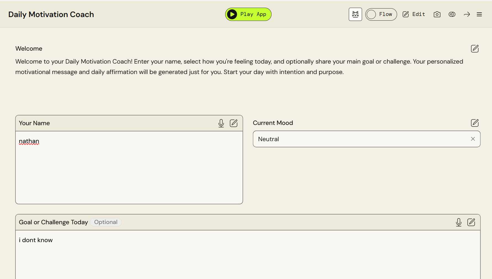
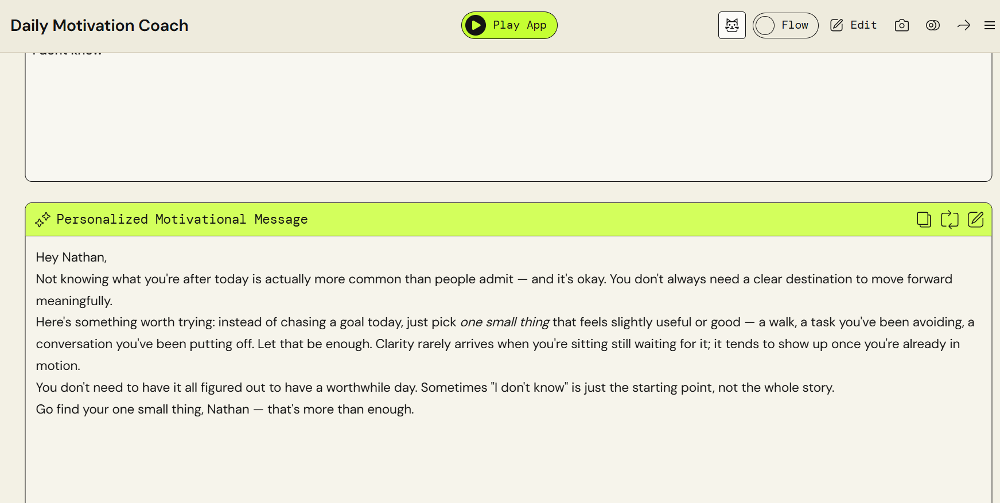

# Daily Motivation Coach 🚀🤖

**Daily Motivation Coach** est une application d'intelligence artificielle interactive conçue pour aider les utilisateurs à démarrer leur journée avec intention, clarté et résilience. 

Ce projet a été développé en tant qu'application pratique et concrète dans le cadre de mon diplôme de l'**AWS AI Practitioner Challenge via Udacity**.

---

## 🔗 Lien de l'Application

Tu peux tester l'application en direct ici :
👉 **[Accéder à Daily Motivation Coach sur AWS PartyRock](INSERE_TON_LIEN_PARTYROCK_ICI)**

---

## 📸 Aperçu de l'Interface

Voici un aperçu visuel de l'application et de son fonctionnement :

---

## 🎯 Vision du Projet

L'objectif est d'allier les capacités des grands modèles de langage (LLM) à une expérience utilisateur simple et intuitive. En saisissant son état d'esprit actuel et ses défis immédiats, l'utilisateur reçoit un accompagnement sur mesure, éliminant les discours génériques pour offrir un boost de motivation ultra-personnalisé.

---

## ✨ Fonctionnalités

* **Analyse de l'Humeur (*Current Mood*) :** Adapte dynamiquement le ton, l'empathie et l'approche de l'IA selon l'état d'esprit de l'utilisateur.
* **Ciblage des Objectifs (*Goal or Challenge*) :** Intègre les défis spécifiques ou les buts optionnels du jour pour formuler des conseils exploitables et pertinents.
* **Génération de Contenu IA :**
    * **Personalized Motivational Message :** Un message de coaching sur mesure pour structurer sa journée.
    * **Daily Affirmation :** Une phrase d'ancrage positive et percutante à s'approprier.

---

## 🛠️ Technologie & Architecture Cloud

L'application est entièrement propulsée par l'écosystème **Amazon Web Services (AWS)** :

* **Plateforme :** [AWS PartyRock](https://partyrock.aws/) – Un espace d'expérimentation basé sur Amazon Bedrock pour concevoir des applications génératives complexes sans code.
* **Moteur d'IA :** Modèles de fondation (Foundation Models) optimisés via du prompt engineering avancé pour garantir des réponses engageantes, humaines et fluides.

---

## 🚀 Parcours Utilisateur (UI)

1.  **Welcome :** Accueil et contextualisation de la session de coaching.
2.  **Inputs :** L'utilisateur renseigne son nom (*Your Name*), son humeur (*Current Mood*) et son défi optionnel (*Goal or Challenge Today*).
3.  **Outputs IA :** Les widgets de PartyRock génèrent instantanément le message de motivation et l'affirmation personnalisée dès que les critères essentiels sont remplis.

---

## 🎓 Contexte Pédagogique

Ce projet démontre la capacité à concevoir, prototyper et déployer rapidement des applications d'IA générative fonctionnelles en exploitant les outils cloud d'AWS. Il valide les compétences acquises lors du programme **AWS AI Practitioner Challenge de Udacity**, notamment en matière de sélection de modèles, de prompt engineering et de structuration d'applications d'IA grand public.

---

## 📝 Licence

Ce projet est sous licence MIT. Voir le fichier [LICENSE](LICENSE) pour plus de détails.
